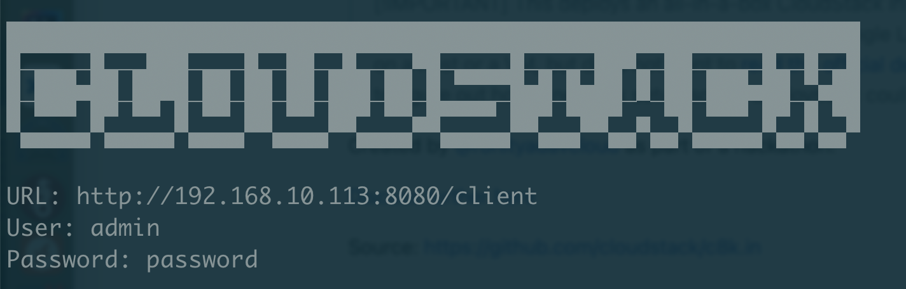

# [c8k.in](https://github.com/apache/cloudstack-installer): One-liner installer for [Apache CloudStack](https://cloudstack.apache.org)

> [!NOTE]
> Supports Apache CloudStack (version >= 4.20) installation on Ubuntu or EL based distro with x86_64 KVM. Please use this on a throwaway host or a VM (with hardware acceleration) that wouldn't hurt you to lose, in an [RFC1918 local private network](https://en.wikipedia.org/wiki/Private_network). This is currently in `beta` and open for users testing and issue reporting.


### 🚀 The Easiest Way to Install Apache CloudStack on Ubuntu or EL-based Distros

One-liners installer automates and simplifies the installation and configuration of **Apache CloudStack** and its components:

- CloudStack Management Server
- CloudStack Agent for KVM Host
- CloudStack Usage Server
- MySQL Server
- NFS Server

---

## Features

- **All-in-One Installation**: Deploy a complete CloudStack setup on a single machine
- **Custom Installation**: Select specific CloudStack components to install
- **Repository Configuration**: Set up CloudStack repository automatically
- **Zone Deployment**: Guided wizard for zone deployment
- **Network Configuration**: Automatically configure network bridges for CloudStack
- **Component Validation**: Verify that all components are properly configured
- **Progress Tracking**: Track installation progress and resume interrupted installations
- Support re-runs, idempotent with tracker

---

## ⚙️ Requirements

| Resource | Minimum |
|-----------|----------|
| **RAM**   | 8 GB     |
| **Disk**  | 75 GB    |
| **Privileges** | Root / `sudo` |
| **Virtualization** | Hardware virtualization (Intel VT-x / AMD-V) |

---

## ✅ Validated Operating Systems

| OS       | Version | Status |
|----------|---------|--------|
| Oracle   | 9       | ✔️ Validated |
| Oracle   | 8       | ✔️ Validated |
| Ubuntu   | 24.04   | ✔️ Validated |
| Ubuntu   | 22.04   | ✔️ Validated |
| Ubuntu   | 20.04   | ✔️ Validated |
| Rocky    | 9       | ✔️ Validated |
| Rocky    | 8       | ✔️ Validated |
| Alma     | 9       | ✔️ Validated |
| Alma     | 8       | ✔️ Validated |

### NOTE: EL10 Distributions (Experimental)
Oracle Linux 10, AlmaLinux 10, and Rocky Linux 10 are supported **only** with CloudStack 4.22.0.0 or later.  
#### Prerequisites - run before the installer

##### AlmaLinux 10 / Rocky Linux 10

```bash
sudo dnf install -y epel-release
sudo dnf install -y genisoimage
```
##### Oracle Linux 10

```bash
sudo dnf install -y oracle-epel-release-el10
sudo dnf install -y genisoimage
```

---

## 📦 Installation

To install and deploy [CloudStack](https://cloudstack.apache.org), just copy and run the following as `root` user:

### Quick Install

```bash
curl -sSfL https://c8k.in/installer.sh | bash
```

### Download and Run

```bash
wget https://c8k.in/installer.sh
chmod +x installer.sh
sudo ./installer.sh
```

---

## 🖥️ Installation Menu Options

When you launch the installer, you’ll see a dialog menu like this:

```
Select an option:
1. All-in-One Installation
2. Custom Installation
3. Configure CloudStack Repository
4. Deploy CloudStack Zone
```

Here’s what each option does:

### **1️⃣ All-in-One Installation**
Performs a full automated setup of Apache CloudStack on a single host.  
Includes installation and configuration of:
- CloudStack Management Server
- KVM Agent (libvirt, bridge, VNC, firewall)
- MySQL database server
- NFS primary and secondary storage
- Usage Server
- Zone Deployment

Ideal for test environments, PoC labs, or quick demos — ready to use in under an hour.

### **2️⃣ Custom Installation**
Lets you select individual components to install and configure.  
Useful when you want to:
- Separate Management and KVM roles across multiple machines 
- Install/Configure or skip specific services (e.g., NFS, CloudStack Agent, Skipping Usage Server)
- Integrate with an existing CloudStack deployment

### **3️⃣ Configure CloudStack Repository**
Sets up the official or custom CloudStack package repository for your OS.  
Automatically detects your distribution (Ubuntu, Debian, RHEL, Rocky, etc.) and configures:
- GPG key
- Repository URL
- Package source file

You can reconfigure repository using this option at any time to switch versions or mirrors.

### **4️⃣ Deploy CloudStack Zone**
After installing the components, this option launches a guided **Zone Deployment Wizard** that:
- Creates a new CloudStack Zone (Advanced networking)
- Adds Pod, Cluster, Host, and Storage resources
- Configures networking (bridge, IP ranges, VLANs)

Perfect for creating a ready-to-use cloud zone in minutes.

---

## 💡 Use Cases
This installer is designed to make **Apache CloudStack** accessible for learning, testing, and experimentation - without needing a large-scale infrastructure.
1. Spin up a fully functional CloudStack zone (management, KVM host, and NFS storage) on a single VM or physical host for development or QA.
2. Ideal for CloudStack contributors to test new PRs, validate feature behaviour across OS.
3. Experiment with configuration, template registration, Network and zone orchestration.
4. Perfect for demo, workshops and PoCs.

---

## 🗂️ Installation Logs & Tracking

| File | Purpose |
|------|----------|
| `installer.log` | Detailed logs for all operations |
| `cloudstack-installer-tracker.conf` | Tracks completed steps to allow safe re-runs |

---

## 🔐 Post-Install Access

After successful setup, CloudStack is accessible at:

```
URL: http://<management-server-ip>:8080/client
Username: admin
Password: password
```
---

## ⚠️ Notes/Common Pitfalls

- Avoid pre-installing Java before running this script. Exisiting java installation can cause version conflicts and may break the installer.
- Use a proper base image when preparing the VM. The ISO should be  at least a Minimal Installation to ensure all required packages are available.
- Installer can't continue if any other process has lock of package manager, you may see such error:

    ```Could not get lock /var/lib/dpkg/lock-frontend. It is held by process 5774 (unattended-upgr)```

- Zone Deployment form provides default parameters optimized for an all-in-one CloudStack installation. Review and adjust these values as needed for your deployment.

---

## 🧰 Utilities Used

- `dialog` for interactive menus
- `apt` or `dnf` for package management
- `systemctl` for service management
- `nmap` for IP discovery

---

## 🪪 License

Licensed under the **Apache License, Version 2.0**  
See [LICENSE](http://www.apache.org/licenses/LICENSE-2.0) for details.

---


> [!IMPORTANT]
> This is only useful for anyone who just wants to try CloudStack on a host or a VM, but does not want to [read the official docs](https://docs.cloudstack.apache.org). It makes several assumptions about the IaaS deployment, and tries to figure out host's network setup so the deployment could work out of the box. This is not advised for production deployment.

Screenshot when the command finishes:



[Discuss further here](https://github.com/apache/cloudstack/discussions)

Get Source or Report an issue: [https://github.com/apache/cloudstack-installer](https://github.com/apache/cloudstack-installer)
